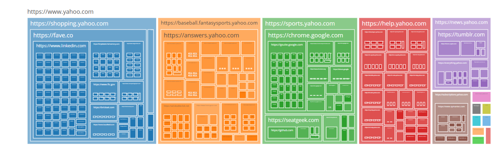

# Base URL Crawling	
Out of curiosity I wanted a way to see just how connected the web is. 	
I build this very simple tool that scrapes base URLs off pages and continues to do this same thing on every page it finds. 	
I was quite surprised to see the infinite number of pages I get to by just putting in googles home page. 	
The tool is hosted on [here on github pages](http://baseurlscrape.tk/), so anyone is welcome to mess around with it.

#### Output

The website will create a tree chart that is interactable by the user. When you are ready to explore the chart it is best to end the web crawling by hitting the stop button.

#### Current Problem
Reverse proxy has a limit of 50,000 requests per day so if the site is not working properly it could be because that max has been hit for the day. Working on a local version that you can run without being dependent on a remote cors proxy.

#### WASM vs JavaScript Versions
This project was originally just to try out hosting a static blazor project on github pages however its not the best tool for the job here. I also have the source code to a javascript alternative that runs much faster. It will hit that 50,000 request limit much faster so I am leaving the WASM version on the website for now.